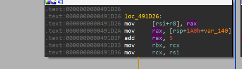

# GoLmol
- Đầu tiên mình thấy trong hàm main_main có 1 hàm check length secret input

- Quan sát 1 hồi thì mình thấy nó set `eax = 33` và `cmp rax, 123` mỗi vòng lặp sẽ `add rax, 5` tức `lengh_secret = 18`


- Nếu bạn không muốn chạy bằng cơm thì có thể dùng máy hihi, đây là đoạn script python để tìm length
```python
from subprocess import Popen, PIPE, STDOUT
for i in range(100):
    inp = 'a' * i
    p = Popen([r'path GoLmol'], stdin=PIPE, stdout=PIPE, stderr=STDOUT)
    tmp = p.communicate(f'{inp}'.encode())[0]
    if b'Correct' in tmp:
        print(i)
        break
```
- Phân tích tiếp mình thấy hàm `runtime_memequal`, debug thì thấy nó `cmp input_secret, value` vậy giờ chỉ cần đặt break point rồi debug 18 lần để lấy từng value là ra secret

- Nhớ set `ZF = 0` ở lệnh jz để có thể tiếp tục debug 

- Ở đây mình cũng code ra 1 đoạn script python để tự động lấy value tuy nhiên chạy từng dòng trên `gdb` thành công nhưng khi run file lại không thành công mặc dù vậy mình vẫn để đây để mọi người tham khảo nếu ai tìm thấy lí do run false thì có thể nhắn tin cho mình. Cảm ơn mọi người rất nhiều ạ hihi
```python
from pwn import *
p = process('gdb')
p.sendline(b'file ./GoLmol')
p.sendline(b'b *0x492069') # breakpoint at memequal function
p.sendline(b'b *0x492070') # breakpoint at jz
p.sendline(b'r')
p.sendline(b'a' * 18)
for i in range(18):
    p.sendline(b"python with open ('flag.txt', 'a') as f: f.write(chr(int(gdb.parse_and_eval('*$rax'))))") 
    # write rax into flag.txt 
    p.sendline(b'c')
    p.sendline(b'set $eflags = ($eflags & ~(1 << 6))') 
    #set bit thứ 6 của eflags tức ZF = 0
    p.sendline(b'c')

p.close()
```
- Sau đó ta sẽ được `secret = !&+05:?DINSX]bglqv`
- Cuối cùng là run file và nhập secret ta được flag = `PCTF{(-27<AFKPUZ_dinsx}`
# Chúc mọi người học tập tốt :)
