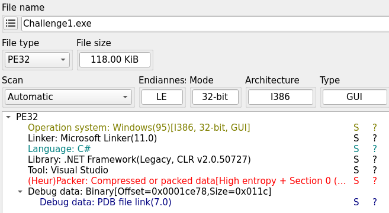
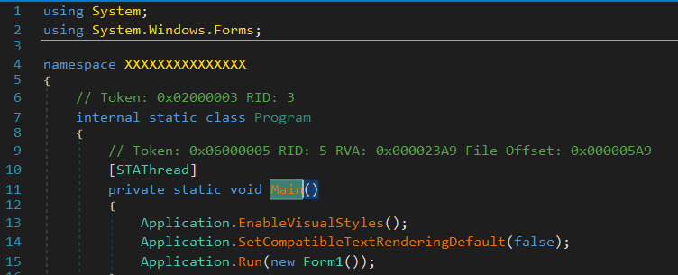
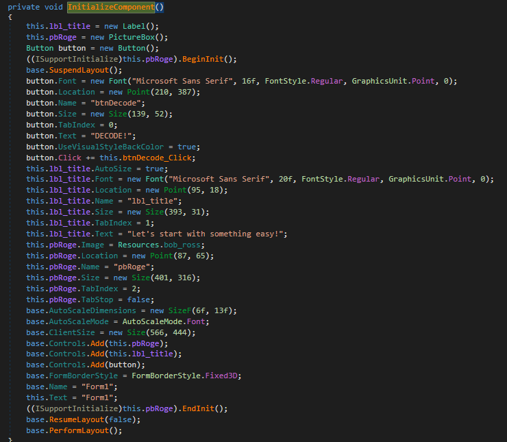
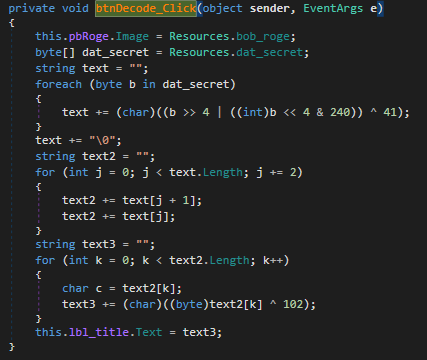
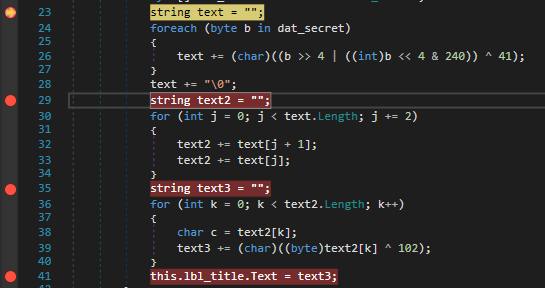
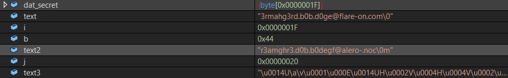

- Use `die` tool, This is an PE32 file on windows code by C#

- Run the test and the screen will display

- After press **DECODE**, the screen will display

- Use `dnSpy` to analysis file, go to entrypoint. In the code, run `Form1` function which seems to display the form on the screen 

- Following `Form1` function, I get to the function to initialize the form. When click button **DECODE**, It call `btnDecode_Click()`

- Following `btnDecode_Click`. It seems to be doing some decoding 

- Set breakpoint and I get the value of `dat_secret`, `text`, `text2`, `text3`

- Finally I got the flag saved in `text` variable