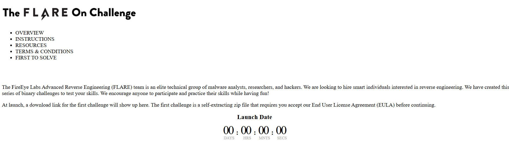
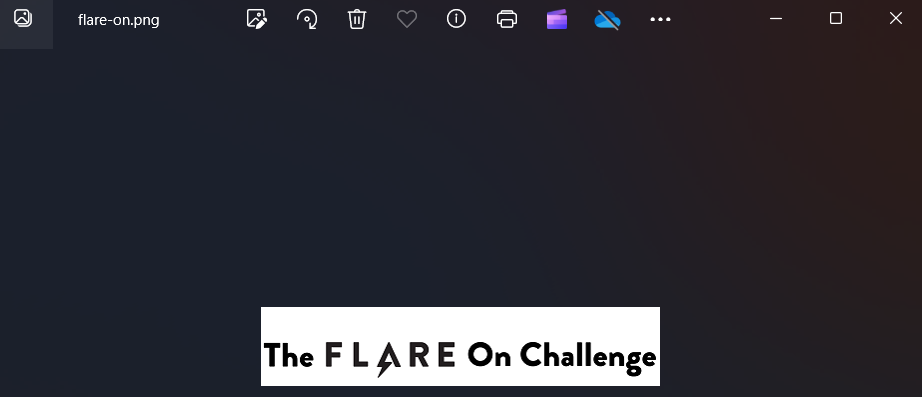
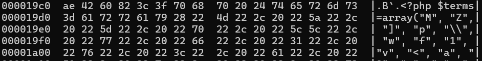
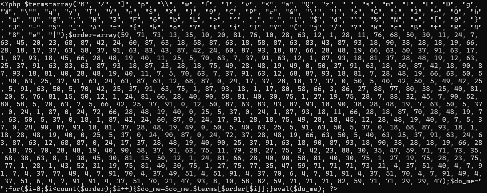
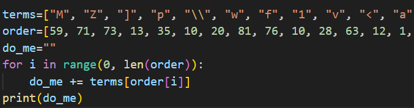
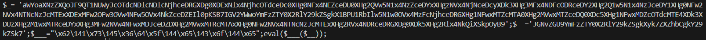
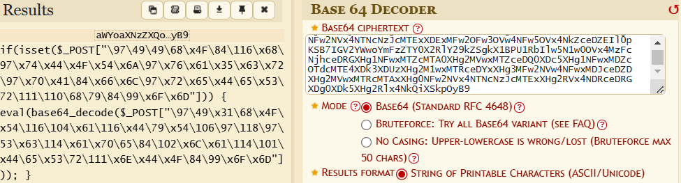
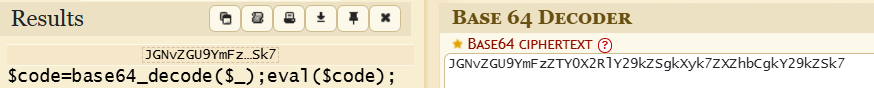

- For this challenge, provite us with html file and png image file
- Content in html file, nothing interesting


- Open file png


- It seems we need to analyze the png to find flag
- Use `hexdump` to analysis file, see `php` code embedded in the file


- Use `strings` to extract content `php` code


- Convert to `python` code



- The output gives us two strings that appear to be encoded in base64


- Try decoding to get results



- Here I get a suspicious string that seems to be a flag, try converting it to strings
```python
import re

s = r"\97\49\49\68\x4F\84\116\x68\97\x74\x44\x4F\x54\x6A\97\x76\x61\x35\x63\x72\97\x70\x41\84\x66\x6C\97\x72\x65\x44\65\x53\72\111\110\68\79\84\99\x6F\x6D"

# Find all form values DEC and HEX in string
matches = re.findall(r"\\x[0-9A-Fa-f]{2}|\\[0-9]{2,3}", s)

# Convert format
result = [m.replace("\\x", "0x").replace("\\", "") for m in matches]

# Convert to string
decoded_str = "".join(chr(int(val, 16) if "0x" in val else int(val)) for val in result)

print(decoded_str) 
```

- Result `a11DOTthatDOTjava5crapATflareDASHonDOTcom`
- Convert to flag `a11.that.java5crap@flare-on.com`
