- This challenge provide a dll file  
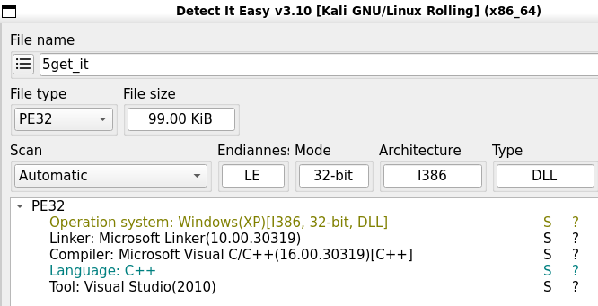

- Look at the main function you can see this function take the current file and copy it to system32 folder and use rundll32.exe to execute by setting the registry  
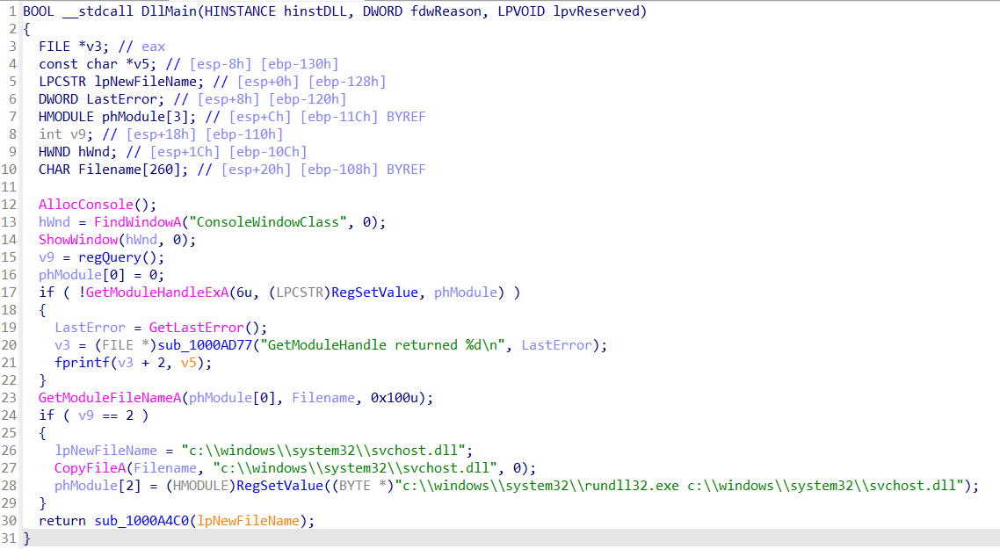

- setRegValue function, set `CurrentVersion\Run` is above execution string to once the computer is turned on, the file will be executed  
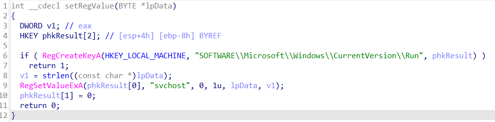

- Go deep into `sub_1000A4C0()`, I realized it là `keyLogger` function. It random a number that is the number of characters that will be read  
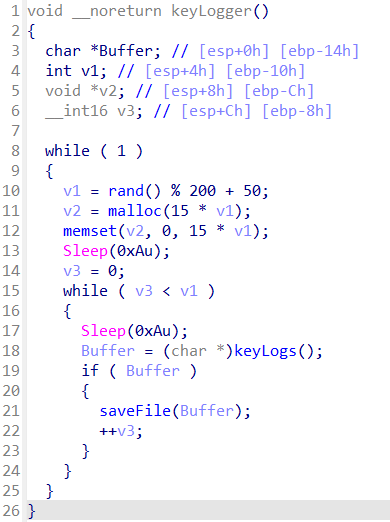

- This function open file and save  
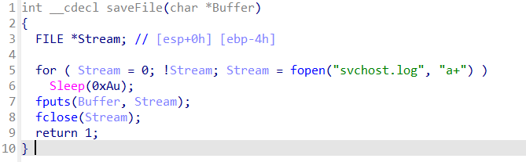

- `keyLogs` function read characters that is user input  
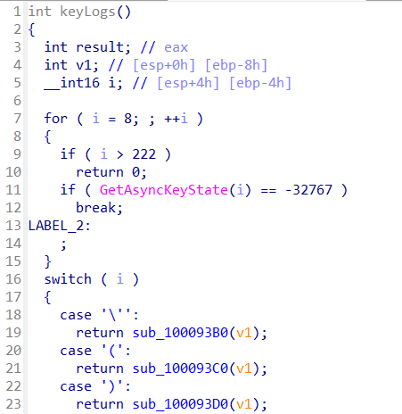

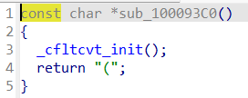

- You can see `_cfltcvt_init()` use to init value  
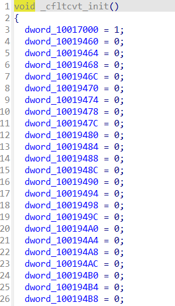

- Some other characters will have a conditional sentence at the begginning  
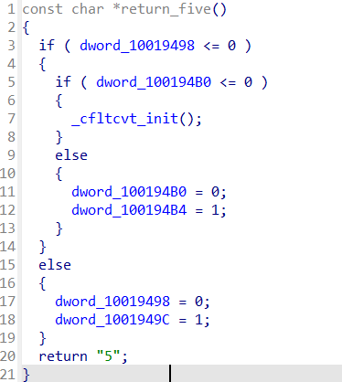
- After a while of research, I found that the conditional in the functions a related to each other. For example to the conditional statment of above function do not jump to `_cfltcvt_init()` function then `dword_100194B0` var must greater than 0d  

- Use `xref` on IDA to trace  
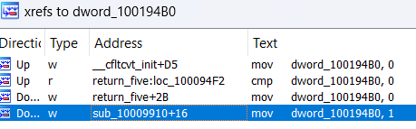

- Finnal I trace to `return_l` function. Var `dword_10017001` is only initialized in `init` function, perhaps this is the beginning 
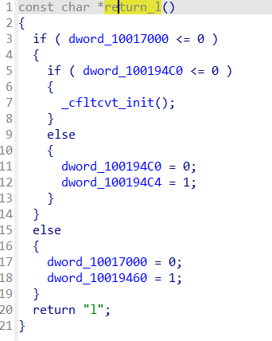

- Now it's time to reverse to find the flag  
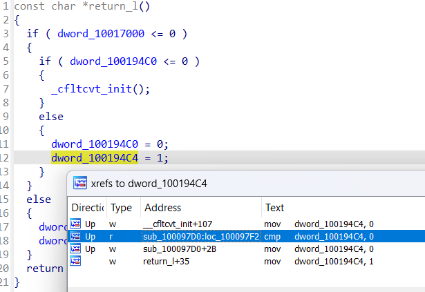
