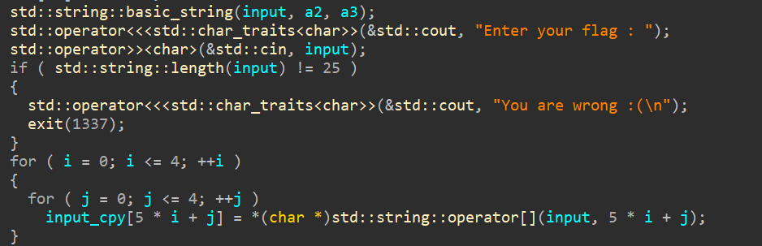
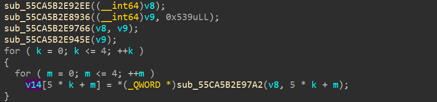
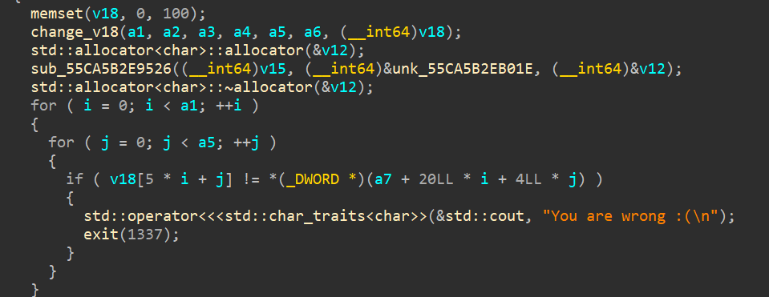
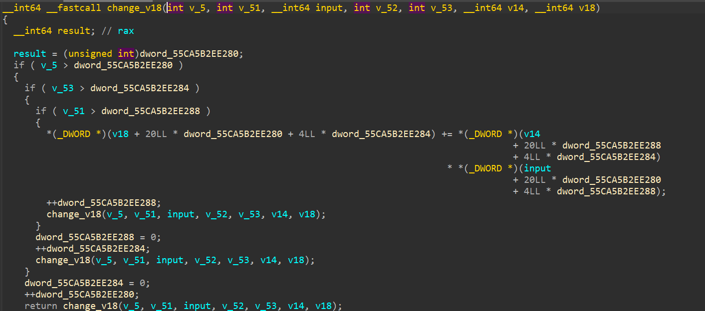

##### Với bài này mình sẽ dùng IDA để làm
- Ban đầu nó sẽ copy sang `input_cpy` 


- Tiếp theo `v8`, `v9` là giá trị có sẵn nên đoạn này chỉ cần debug là ta tim được `v14`


- Sau đó tiếp tục **trace** ta dễ dàng đến được đây 


- Ở đây `a7` được tham chiếu từ `v12` với những giá trị có sẵn ở hàm `main`
- `jump` đến hàm `change_v18` để xem input_user tác động như nào đến `v18`


- Quan sát 1 lúc thì mình nhận thấy rằng hàm này sẽ tạo ra 5 hệ phương trình 5 ẩn kiểu như:
```
a1*x1 + a2*x2 + a3*x3 + a4*x4 + a5*x5 = v18
```
- Từ đây ta hoàn toàn có thể tính được `input`, lúc đầu mình định dùng `module Z3` nhưng sau 1 hồi thì vẫn ra 1 số kí tự `input` sai mình đoán chắc là do `Bitvec` giới hạn 8 bit vẫn là nhiều, mình co dần giới hạn lại và dần ra flag đúng hơn nhưng vẫn sai 1 số từ, nên để đây để mn tham khảo hihi.
```python
from z3 import *

v12 = [
  0xAD, 0x43, 0x00, 0x00, 0xFC, 0x4C, 0x00, 0x00, 0xA8, 0x52, 
  0x00, 0x00, 0xA2, 0x5A, 0x00, 0x00, 0x1C, 0x65, 0x00, 0x00, 
  0x81, 0x48, 0x00, 0x00, 0x03, 0x52, 0x00, 0x00, 0xDF, 0x57, 
  0x00, 0x00, 0x43, 0x60, 0x00, 0x00, 0x51, 0x6B, 0x00, 0x00, 
  0xC6, 0x49, 0x00, 0x00, 0x8F, 0x53, 0x00, 0x00, 0x75, 0x59, 
  0x00, 0x00, 0x31, 0x62, 0x00, 0x00, 0x6B, 0x6D, 0x00, 0x00, 
  0xDC, 0x42, 0x00, 0x00, 0x10, 0x4C, 0x00, 0x00, 0xAC, 0x51, 
  0x00, 0x00, 0xB8, 0x59, 0x00, 0x00, 0x48, 0x64, 0x00, 0x00, 
  0x63, 0x1F, 0x00, 0x00, 0x75, 0x24, 0x00, 0x00, 0xC9, 0x27, 
  0x00, 0x00, 0x8D, 0x2C, 0x00, 0x00, 0x3F, 0x33, 0, 0
]
v18 = []
for i in range(0, 99, 4):
    v18.append(int.from_bytes(v12[i:i+4], byteorder='little'))

v14 = [
  0x02,  0x03,  0x05,  
    0x07,  0x0B,  
  0x0D,  0x11,  0x13,  
    0x17,  0x1D,  
  0x1F,  0x25,  0x29,  
    0x2B,  0x2F,  
  0x35,  0x3B,  0x3D,  
    0x43,  0x47,  
  0x49,  0x4F,  0x53,  
    0x59,  0x61
  ]

flag =  [BitVec(f'f{i}', 8) for i in range(25)]
cipher = [BitVec(f'c{i}', 16) for i in range(25)]
s = Solver()

for i in range(25):
    cipher[i]  = 0
for i in range(25):
    s.add(And(flag[i] <= 127, flag[i] >= 47))

for i in range(5):
    for j in range(5):
        for k in range(5):
            cipher[5 * i + j] += (v14[5* k + j] * flag[5 * i + k]) 
        s.add(cipher[5* i + j] == v18[5 * i + j] )

if s.check() == sat:
    m = s.model()
    for i in range(25):
        print(chr(m[flag[i]].as_long()),end = '')
``` 
- Tuy nhiên mình có cách khác hay hơn đó là giải hệ phương trình bằng `module numpy` và `module scipy`
```python
import numpy as np
from scipy.linalg import solve

# Định nghĩa hệ số của hệ phương trình
A = np.array([[2 , 13, 31, 53, 73],
              [3 , 17, 37, 59, 79],
              [5 , 19, 41, 61, 83],
              [7 , 23, 43, 67, 89],
              [11 , 29, 47, 71, 97]])

# Định nghĩa vector b (phần bên phải của hệ phương trình)
c = [0x43ad, 0x4cfc, 0x52a8, 0x5aa2, 0x651c, 0x4881, 0x5203, 0x57df, 0x6043, 0x6b51, 0x49c6, 0x538f, 0x5975, 0x6231, 0x6d6b, 0x42dc, 0x4c10, 0x51ac, 0x59b8, 0x6448, 0x1f63, 0x2475, 0x27c9, 0x2c8d, 0x333f]
for i in range(0, 25, 5):
    b = np.array(c[i:i+5])
    x = solve(A, b)
    print(x , end='')
# flag = [103. 111. 111. 100.  95.][106. 111.  98.  95. 121.][111. 117.  95. 115. 111.][108. 118. 101. 100.  95.][114. 101.  48.  49.  33.]
# good_job_you_solved_re01!
```
- Với cách này thì b cần phải quan sát quy luật lặp sẽ thấy `v14` lặp lại giá trị của hệ phương trình đầu, `v18` sẽ lần lượt tăng thêm 1 còn `input` tăng thêm 5 sau mỗi hệ phương trình 
# Chúc mn học tập tốt :))
